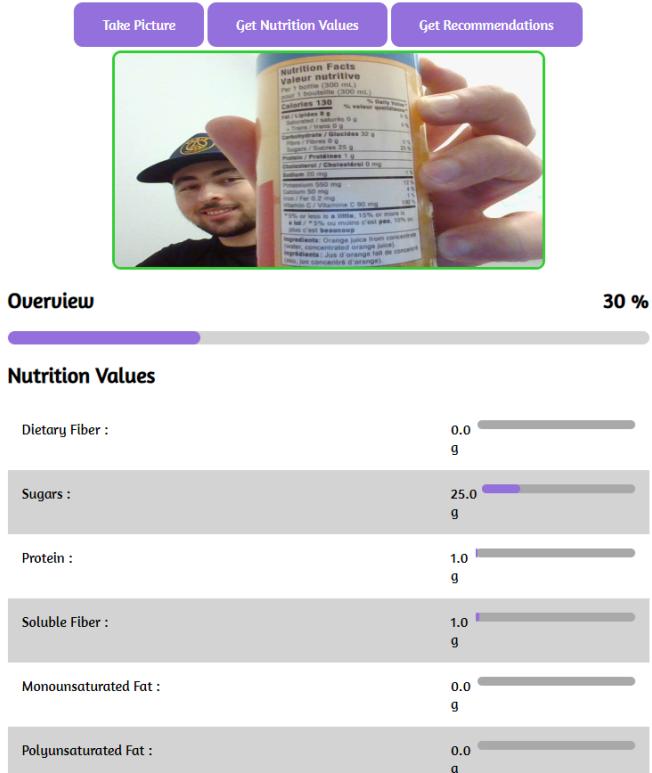

# ScanHealthy

Everyday Young Life - Scan nutrition facts

## Project Overview

- `eyl-android` holds the Android app sources for ScanHealthy
- `eyl-web` contains the Angular frontend for camera capture
- `eyl-server` has the image processing logic and Django API built on Open Food Facts
